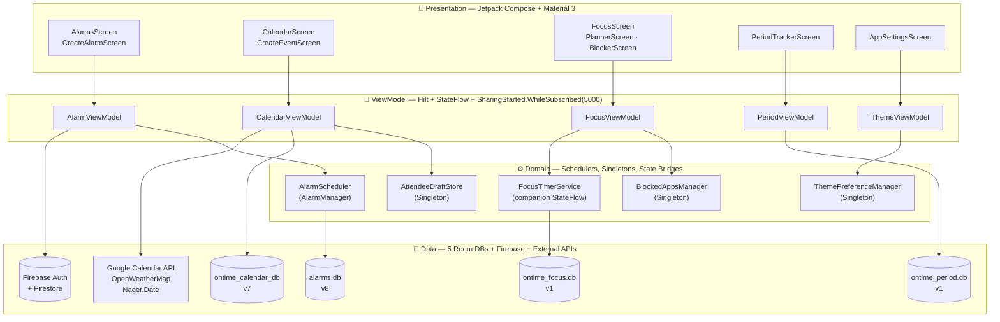
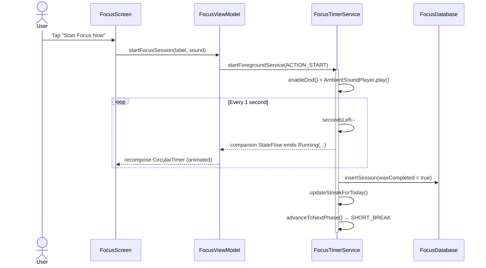
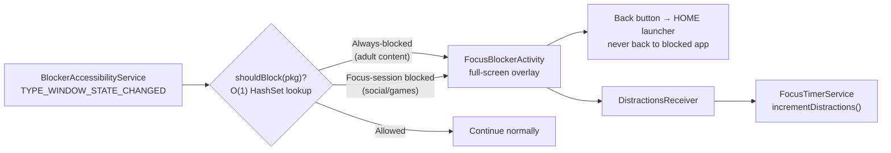
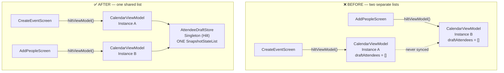
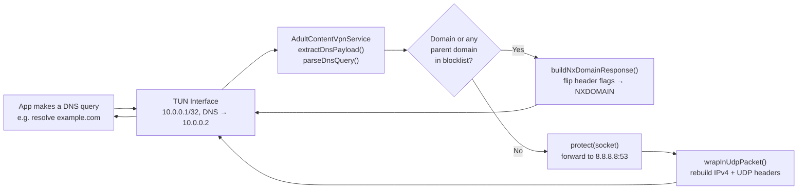

<div align="center">


<br/>

[](https://github.com/TUSHARTAMRAKAR/Ontime/releases)
[](https://github.com/TUSHARTAMRAKAR/Ontime/releases)
[](https://kotlinlang.org)
[](#-architecture)
[](#-database-architecture)
[](https://github.com/TUSHARTAMRAKAR/Ontime/releases)
[](./LICENSE)
[](https://github.com/TUSHARTAMRAKAR/Ontime/stargazers)

<br/>

[🌐 **Website**](https://tushartamrakar.github.io/Ontime) &nbsp;·&nbsp;
[⬇️ **Download APK**](https://github.com/TUSHARTAMRAKAR/Ontime/releases/latest) &nbsp;·&nbsp;
[🏗️ **Architecture**](#-architecture) &nbsp;·&nbsp;
[🔬 **Engineering Deep Dives**](#-engineering-deep-dives--hard-problems-real-solutions) &nbsp;·&nbsp;
[🐛 **Issues**](https://github.com/TUSHARTAMRAKAR/Ontime/issues) &nbsp;·&nbsp;
[✉️ **Contact**](mailto:tushartamrakar2003@gmail.com)

</div>

<br/>

> *A single, ad-free Android app replacing five separate apps in my daily life — a smart alarm clock, a Pomodoro focus timer with a real app blocker, a calendar that actually syncs, a period tracker that never phones home, and cloud-synced settings — all hand-built in Kotlin with Jetpack Compose, from the database schema up to the pixel.*

---

## 📖 Table of Contents

- [About Ontime](#-about-ontime)
- [Feature Modules](#-feature-modules)
- [Architecture](#-architecture)
- [Engineering Deep Dives — Hard Problems, Real Solutions](#-engineering-deep-dives--hard-problems-real-solutions)
- [Database Architecture](#-database-architecture)
- [Design Pattern Catalog](#-design-pattern-catalog--architecture-decision-records)
- [By The Numbers](#-by-the-numbers)
- [Project Structure](#-project-structure)
- [Tech Stack](#%EF%B8%8F-tech-stack)
- [Download & Install](#-download--install)
- [Roadmap](#%EF%B8%8F-roadmap)
- [The Developer](#-the-developer)
- [With Gratitude](#-with-gratitude)
- [License](#-license)

---

## 📱 About Ontime

**Ontime** is a from-scratch, all-in-one Android productivity application — written entirely in **Kotlin** with **Jetpack Compose** and **Material Design 3**, architected with **MVVM + Clean Architecture** and **Hilt** dependency injection.

It wasn't built by following a tutorial. It was built by *needing* it — by hitting real OEM bugs at 2am, by reading raw `logcat` output line-by-line until a Realme firmware quirk revealed itself, by tearing down a Compose Navigation ViewModel-scoping assumption that "everyone knows" is true (and isn't), and by writing a DNS packet parser from the RFC up because no library did exactly what was needed without phoning home.

```
⏰ Wake up smart   →   🎯 Stay focused   →   📅 Stay organised   →   🌸 Stay healthy   →   ☁️ Stay in sync
```

Every module below ships with its **own Room database**, its **own ViewModel**, and its **own set of Compose screens** — five vertical slices of a single, cohesive app.

> 🚀 **Currently in Public Beta v0.1.0.** Every report and star directly shapes what gets built next.

---

## ✨ Feature Modules

<table>
<tr><td width="50%" valign="top">

### ⏰ Smart Alarms
*Room DB v8 · 22 fields · 7 migrations*

- 🌅 **Gentle Wake** — volume ramps from near-silence to full over up to 5 minutes
- 🗣️ **Time Announcement (TTS)** — speaks greeting + day + date + time, male/female voice via pitch control (`0.6f` / `1.8f`)
- 🌤️ **Weather Reminder** — GPS + OpenWeatherMap, reads forecast aloud (survived a 3-day OEM bug — [see Case Study #1](#-case-study-1--the-phantom-permission-dialog))
- 🏷️ **Label Reminder** — reads your alarm's label aloud so you remember *why*
- 📢 **Extra Loud Mode** — 35s normal ringtone, then 10-tone siren sequence at absolute max volume, looping until dismissed
- 😴 **Progressive Snooze** — each snooze gets *shorter* (`max(1, interval − count×2)`), with visual timeline and configurable limits
- ☁️ **Firebase Cloud Sync** — restores instantly on a new device, with an `AtomicBoolean` guard preventing double-restore races

</td><td width="50%" valign="top">

### 🎯 Focus Timer
*Room DB v1 · 5 entities · 30+ DAO queries*

- 🍅 **Pomodoro Engine** — `FocusTimerService` with a **companion-object `StateFlow`**, surviving ViewModel destruction with zero binding code
- ⏱️ **Stopwatch & Custom modes** *(in progress)*
- 🌧️ **8 Ambient Sounds** — Rain, White/Brown Noise, Forest, Ocean, Café, Lo-fi, Silence — all wrapped in `runCatching` for graceful missing-asset handling
- 🔥 **Streak Engine** — walks a `focus_streaks` table backwards from today/yesterday to compute current + longest streaks
- 📊 **Focus Score** — `40% completion + 30% goal progress + 30% streak`, rendered as an animated Canvas ring
- 🌙 **Do Not Disturb** integration — auto-enables during WORK phase, restores only if *we* enabled it
- 📈 **Full Stats Suite** — weekly bar chart, 24-hour heatmap, quality metrics, all Canvas-drawn and animated

</td></tr>
<tr><td width="50%" valign="top">

### 🛡️ App Blocker
*AccessibilityService + Custom VPN*

- 🚧 **Session Blocker** — `BlockerAccessibilityService` watches `TYPE_WINDOW_STATE_CHANGED`, O(1) `HashSet` lookup, 2s cooldown to prevent overlay spam
- 🌐 **DNS-Proxy Adult Filter** — a hand-built local VPN intercepting **only port 53** — zero HTTPS inspection, zero data leaves device ([see Case Study #3](#-case-study-3--a-dns-firewall-from-scratch-on-device))
- 🔒 **Device Admin Protection** — adds friction to uninstall while protection is active, no dangerous policies declared
- 📵 **50,000+ domain blocklist capacity** with parent-domain matching (`pornhub.com` also blocks `images.pornhub.com`)
- 🏠 **Blocked apps surface a full-screen overlay** that routes *Back* to the home launcher — never back to the blocked app

</td><td width="50%" valign="top">

### 📅 Smart Calendar
*Room DB v7 · 3 entities*

- 📲 **Google Calendar API** two-way sync
- 🎉 **Holiday Overlays** via Nager.Date — **11 years loaded in parallel in ~100ms** (was 66 seconds sequential — [see Case Study #4](#-case-study-4--from-66-seconds-to-100-milliseconds))
- 💾 **24-hour disk cache** (`SharedPreferences`, JSON-serialized) — survives app restarts with zero network calls
- 👥 **Attendee Management** — manual email/phone entry with validation, shared across screens via a `Singleton SnapshotStateList` ([see Case Study #2](#-case-study-2--two-viewmodels-walk-into-a-navgraph))
- 📩 **SMS & Email Invites** via `Intent(ACTION_SENDTO)` — opens the user's own app for confirmation, never silent
- 📆 Month / Week / Day views with colour-coded categories

</td></tr>
<tr><td width="50%" valign="top">

### 🌸 Period Tracker
*Room DB v1 · 3 entities · 100% offline*

- 📊 Cycle logging with start/end dates
- 😷 30+ symptom tags + daily mood tracking
- 🔮 Cycle length prediction from personal history
- 🔔 Smart pre-period & ovulation reminders
- 🔒 **Zero network calls. Ever.** This data physically cannot leave the device — there is no sync code path for it.

</td><td width="50%" valign="top">

### 🌗 Theme Engine & Cloud Sync
*CompositionLocal-driven, live-switching*

- 🌑 **Deep Space Dark** (`#0A0A0F`) and 🌕 **Pearl & Amethyst Light** (`#F6F3F0`) palettes
- ⚡ Instant theme switching via `CompositionLocalProvider` — **zero Activity restart**
- 💾 `ThemePreferenceManager` — a `@Singleton` `StateFlow` shared between `MainActivity` and `SettingsScreen` ViewModels
- ☁️ Firestore-backed alarm cloud sync with last-write-wins conflict resolution
- 🔑 PIN + Biometric App Lock

</td></tr>
</table>

---

## 🏗️ Architecture

Ontime follows **MVVM + Clean Architecture**, but the most important architectural decision was made *before* any of that: **every feature module owns its own Room database.** A schema migration in Focus can never touch Alarm. A bug in Period Tracker can never corrupt Calendar. Five small, independently-versioned databases instead of one God-database.



### Module Communication: The Service-as-Source-of-Truth Pattern

The Focus Timer is the heart of the app's most interesting architecture decision — instead of a bound `Service` with `ServiceConnection` boilerplate, `FocusTimerService.timerState` is a **companion-object `StateFlow`**. The ViewModel reads it *directly*, no binding required:



If the Activity is destroyed and recreated mid-session — rotation, low memory, whatever — the new `FocusViewModel` instance reads `FocusTimerService.timerState` and the UI picks up **exactly where the countdown is**, with zero state-restoration code.

### The App Blocker Pipeline



---

## 🔬 Engineering Deep Dives — Hard Problems, Real Solutions

Anyone can list features. What separates a toy project from a production codebase is what happens when the framework's assumptions turn out to be wrong, when the OEM's firmware lies to you, and when "just use a library" isn't an option. These four case studies are taken directly from the development logs — real bugs, real `logcat` output, real fixes.

<br/>

### 🐛 Case Study #1 — The Phantom Permission Dialog

**Symptom:** Enabling the Weather Reminder toggle in `CreateAlarmScreen` would flip **ON**, then instantly snap back to **OFF** — every single time, on a real Realme X3 device. On the emulator, it worked fine.

**Three attempts, three failures:**

| Attempt | Hypothesis | Result |
|---|---|---|
| 1 | Permission launcher callback was setting `weatherReminder = false` on denial → set it `true` in the callback instead | ❌ Still snapped off |
| 2 | Check permission *before* launching the dialog, only launch if not yet granted | ❌ Still snapped off |
| 3 | Full rewrite of the permission flow, set `true` immediately at the top | ❌ Still snapped off |

**The breakthrough** came from a `logcat` pulled from the *real device* (the first logcat had accidentally been from an x86_64 emulator — `EGL_emulation` in the trace gave it away):

```
OplusQConfigSetting: not whitelist com.tushartamrakar.ontime
AuthDialogHelper: CheckNotificationCanBeSetSecond:
  Notification master switch on, unable to pop dialog
```

**Root cause:** Realme's Oplus OS **silently denies runtime permission requests for apps it hasn't whitelisted** — without ever showing the system permission dialog to the user. The OS returns `DENIED` instantly. Our code, written against the documented Android behaviour, interpreted that denial as "the user said no" and reset the toggle. This behaviour is **completely undocumented** anywhere in the Android SDK.

**The fix — optimistic state, never-revert:**

```kotlin
onCheckedChange = { checked ->
    if (checked) {
        weatherReminder = true   // ← Set TRUE first. Always. Before anything async.

        val hasFine   = checkSelfPermission(ACCESS_FINE_LOCATION)   == GRANTED
        val hasCoarse = checkSelfPermission(ACCESS_COARSE_LOCATION) == GRANTED

        if (hasFine || hasCoarse) fetchLocation()
        else locationPermissionLauncher.launch(...)
        // Toggle stays ON regardless of what the OS does next.
    } else {
        weatherReminder = false
        locationStatus = "idle"
    }
}
```

Instead of a binary on/off driven by permission results, the UI became a **5-state status machine** (`idle / fetching / saved / failed / permission_needed`), each with its own actionable recovery path — including a button that opens `ACTION_LOCATION_SOURCE_SETTINGS` directly so the user can flip on GPS without hunting through Settings.

> **Lesson:** On a fragmented OS ecosystem, your state must never *depend* on an async callback succeeding. State the intent first; let the UI guide the user through whatever the OS actually does — because it might not be what the documentation says.

<br/>

### 🐛 Case Study #2 — Two ViewModels Walk Into a NavGraph

**Symptom:** A user adds three guests on `AddPeopleScreen`, taps Done, returns to `CreateEventScreen` — and the attendee count shows **"None."** Every time. Data wasn't being lost on save; it was being lost *the moment the second screen opened*.

**Root cause** is a property of `hiltViewModel()` in Navigation-Compose that's easy to miss: **a ViewModel is scoped to its `NavBackStackEntry`**, not to the navigation graph as a whole.



`CreateEventScreen` got **Instance A** of `CalendarViewModel`, with its own `mutableStateListOf<EventAttendeeEntity>()`. `AddPeopleScreen` — a *different destination* in the same graph — got **Instance B**, with a completely separate list living at a different memory address. Adding people on screen B modified a list that screen A would never read.

**The fix** — `AttendeeDraftStore.kt`, an entire file that is, deliberately, four lines of substance:

```kotlin
@Singleton
class AttendeeDraftStore @Inject constructor() {
    val draftAttendees: SnapshotStateList<EventAttendeeEntity> = mutableStateListOf()
}
```

Both `CalendarViewModel` instances now **inject the same singleton** and delegate to it:

```kotlin
class CalendarViewModel @Inject constructor(
    private val attendeeDraftStore: AttendeeDraftStore,
) : ViewModel() {
    val draftAttendees get() = attendeeDraftStore.draftAttendees
}
```

No `LaunchedEffect` sync. No `savedStateHandle` round-trip. No "copy the list back when navigating." Because `@Singleton` guarantees **exactly one instance for the entire app lifetime**, both ViewModel instances are reading and writing *the same object in memory*. It isn't synchronized — it never needed to be.

> **Lesson:** In Compose Navigation, "the ViewModel" is not a single thing. If two destinations need to share mutable state, that state needs to live in something Hilt guarantees is singular — and a one-line `@Singleton` class is often the cleanest possible fix.

<br/>

### 🐛 Case Study #3 — A DNS Firewall, From Scratch, On-Device

**The goal:** an adult-content filter that works **completely offline**, sends **zero data** to any third party, requires **no SDK, no subscription, no cloud lookup** — and survives a device reboot.

**The approach:** `AdultContentVpnService` — a local `VpnService` that establishes a TUN interface and routes **only DNS traffic (UDP port 53)** through itself. Everything else — HTTPS, app traffic, video streams — passes through completely untouched. Nothing is inspected except domain names being resolved.



**The hard parts, solved by hand:**

- **`establish()` configuration** — `addAddress("10.0.0.1", 32)`, `addDnsServer("10.0.0.2")`, `addRoute("10.0.0.2", 32)`. Only the DNS server IP is routed through the tunnel; everything else bypasses the VPN entirely.
- **Raw packet parsing** — `extractDnsPayload()` walks a raw IPv4 packet: validates IHL, checks `protocol == 17` (UDP), confirms destination port 53, and slices out the DNS payload starting at byte 28.
- **DNS question parsing** — `parseDnsQuery()` reads the length-prefixed label sequence starting at byte 12 (past the 12-byte header) and reconstructs the domain string.
- **Parent-domain matching** — `AdultDomainBlocklist.isBlocked()` doesn't just check the exact domain; it walks up through every parent (`images.pornhub.com` → `pornhub.com` → `com`) so a single blocklist entry covers every subdomain automatically:

```kotlin
fun isBlocked(domain: String): Boolean {
    val lower = domain.lowercase().trimEnd('.')
    if (blocklist.contains(lower)) return true
    var dotIdx = lower.indexOf('.')
    while (dotIdx != -1) {
        if (blocklist.contains(lower.substring(dotIdx + 1))) return true
        dotIdx = lower.indexOf('.', dotIdx + 1)
    }
    return false
}
```

- **NXDOMAIN synthesis** — for a blocked domain, `buildNxDomainResponse()` doesn't drop the packet (which would just cause a timeout and retry storm); it copies the original query, flips response byte 2 to `0x81` (QR=1, RD=1) and byte 3 to `0x83` (RA=1, RCODE=3 = NXDOMAIN), and zeroes the answer counts — a textbook-correct "this domain doesn't exist" response, returned in microseconds.
- **The VPN loop trap** — forwarding an allowed query to `8.8.8.8` from *inside* a VPN service would normally route back through the VPN itself, looping forever. The fix is one call: `protect(socket)` — which tells the OS "this specific socket bypasses the VPN," breaking the loop.
- **Manual packet reconstruction** — `wrapInUdpPacket()` builds a minimal 20-byte IPv4 header (version, TTL, protocol=17, swapped src/dst) and 8-byte UDP header (swapped ports, length) by hand, around the real DNS response bytes, before writing back to the TUN `FileOutputStream`.

> **Lesson:** "Block at the DNS level" sounds like a one-line config option — until you realise that on Android, *you are the DNS server*, and that means parsing IPv4 and UDP headers byte-by-byte, synthesizing valid DNS responses, and protecting your own forwarding socket from your own VPN. The result, though, is a content filter with a genuinely unbeatable privacy story: there is no server to subpoena, because there is no server.

<br/>

### 🐛 Case Study #4 — From 66 Seconds to 100 Milliseconds

**Symptom:** Searching the calendar for an event triggered a **66-second freeze** while holiday data loaded across 11 years.

**Investigation via `logcat`** revealed two compounding problems:

1. **121 sequential calls** to `getHolidaysForMonth()` — all queued behind a *single* `fetchMutex`, so even though the device had plenty of bandwidth, every month waited for the previous one to fully complete.
2. The **Nager.Date API returns HTTP `204 No Content` for India** — and the existing retry logic treated `204` like a transient failure, retrying with **2-second then 4-second backoffs** before finally falling back. That's **6 seconds wasted per year**, ×11 years, ×sequential = **66 seconds**, just for years that had *no data to return in the first place*.

**The two-part fix:**

**Part 1 — `getHolidaysForYearSearch()`:** fetch an entire year in **one** API call, bypass the per-month `fetchMutex` entirely, and use a `ConcurrentHashMap<Int, List<LiveHoliday>>` so 11 coroutines can write results **simultaneously** without any locking:

```kotlin
val jobs = (currentYear - 5..currentYear + 5).map { year ->
    async { holidayCache.getHolidaysForYearSearch(year) }   // 11 in parallel
}
jobs.forEach { it.await() }   // results stream in as each year completes
```

**Part 2 — treat `204` as instant fallback, not a retry trigger:**

```kotlin
if (responseCode == 204) {
    Log.d(TAG, "Nager 204 (no data) for $year/$countryCode — skipping retries")
    return@withContext getFallbackHolidays(year, countryCode)
}
```

**The result:**

```
BEFORE:  66.000 seconds  (sequential fetch + 6s wasted retries × 11 years)
AFTER:    ~0.1–0.5 seconds  (11-way parallel fetch + zero-retry 204 handling)

           → A 660x improvement.
```

Combined with a 24-hour `SharedPreferences` disk cache (added in the same pass), a cold app launch on day 2 onward performs **zero network calls** for holiday data at all.

> **Lesson:** A `204 No Content` is not an error — it's an answer. Retrying it is retrying *nothing*, repeatedly, on a timer. And when N independent units of work share one mutex "to be safe," check whether they actually need to be safe from each other at all — often, the safety was protecting against a race that the data structure (here, `ConcurrentHashMap`) already handles for free.

---

## 💾 Database Architecture

Five independently-versioned Room databases — one per feature module, zero cross-contamination:

| Database | Version | Entities | Notable Design |
|---|:---:|---|---|
| `alarms.db` | **v8** | `AlarmEntity` (22 fields) | 7 sequential migrations (v1→v8), each adding one feature's fields — TTS, weather, label reminder, extra loud, progressive snooze |
| `ontime_calendar_db` | **v7** | `CalendarEventEntity`, `EventCategoryEntity`, `EventAttendeeEntity` | Backed by a `SharedPreferences` JSON disk cache with 24h TTL for holiday data |
| `ontime_focus.db` | **v1** | `FocusSessionEntity`, `FocusStreakEntity`, `BlockedAppEntity`, `PlannerTaskEntity`, `FocusSettingsEntity` | 30+ hand-written DAO queries including a Monday-aligned weekly aggregation and a 24-slot hourly heatmap |
| `ontime_period.db` | **v1** | `CycleEntity`, `PeriodLogEntity`, `PeriodSettingsEntity` | No network-capable code path exists anywhere in this module — sync is architecturally impossible, not just disabled |
| `ontime_tasks.db` | **v1** | `TaskEntity`, `TaskListEntity` | Standalone task list, independent of the Focus module's `PlannerTaskEntity` |

### `AlarmEntity` — a schema's growth, migration by migration

```
v1  Base fields: id, hour, minute, label, isEnabled, repeatDays, sound, vibrate,
    tasks, riseCheckMinutes, createdAt

v2  + volume: Float
v3  + gentleWakeUpSeconds: Int
v4  + timeAnnouncement: Boolean, announcementVoice: String
v5  + weatherReminder: Boolean
v6  + labelReminder: Boolean
v7  + extraLoud: Boolean
v8  + snoozeEnabled: Boolean, snoozeIntervalMinutes: Int,
      snoozeLimit: Int, snoozeProgressiveMode: Boolean
```

Every version bump shipped with a real `MIGRATION_X_Y` using `ALTER TABLE ... ADD COLUMN` — no destructive fallback for this database, because losing a user's saved alarms on an app update was never acceptable.

---

## 🗂️ Design Pattern Catalog — Architecture Decision Records

These are the rules the codebase enforces on itself. Each was learned the hard way, and each is now load-bearing — breaking one cascades into the bug it was written to prevent.

| # | Pattern | Rule | Why |
|:---:|---|---|---|
| 1 | **Singleton Draft Bridge** | Cross-screen mutable state (e.g. `draftAttendees`) lives in a `@Singleton`, never directly on a `hiltViewModel()`-scoped ViewModel | Two destinations in the same nav graph get *different* ViewModel instances — see [Case Study #2](#-case-study-2--two-viewmodels-walk-into-a-navgraph) |
| 2 | **Companion-Object Service State** | Long-running service state (`FocusTimerService.timerState`) is exposed as a companion `StateFlow`, never via `ServiceConnection`/binding | Eliminates lifecycle coupling entirely — the ViewModel reads state whether or not it's "connected" |
| 3 | **EntryPoint for Non-Hilt Android Components** | `AccessibilityService` / `VpnService` fetch dependencies via `EntryPointAccessors.fromApplication()`, never `@Inject` | These components are instantiated by the OS outside Hilt's object graph |
| 4 | **Signal-Driven Cache Invalidation** | Never key a `LaunchedEffect` on `currentRoute` for expensive reloads — key it on an explicit `savedStateHandle` boolean flag | `currentRoute` changes on *every* navigation; a signal flag only fires when something actually changed |
| 5 | **One Room Database Per Feature** | Never add one module's entities to another module's `@Database` | Keeps migrations independent — a bug in one module's schema can never corrupt another's |
| 6 | **`SharingStarted.WhileSubscribed(5000)`** | Every `stateIn()` in every ViewModel uses this, never `Eagerly` | Cancels upstream collection 5s after the last observer leaves — real resource savings when a screen is backgrounded |
| 7 | **Optimistic State on Fragmented OEMs** | Set intent state (`= true`) *before* any async permission/IO call resolves; never revert it in the failure branch | Some OEMs (Realme/Oplus) silently deny permissions without user interaction — see [Case Study #1](#-case-study-1--the-phantom-permission-dialog) |
| 8 | **Intent-Only Service Control** | ViewModels start/stop/control `FocusTimerService` purely via `Intent` actions, never a bound interface | The service must outlive the ViewModel that started it — binding would tie their lifecycles together incorrectly |
| 9 | **`distinctBy` Before Every LazyColumn Key** | Any list rendered with a `key = {}` in Compose is deduplicated first (e.g. `installedApps.distinctBy { it.packageName }`) | `PackageManager.queryIntentActivities()` returns duplicate entries for apps with multiple launcher activities — an un-deduplicated list crashes on scroll |
| 10 | **User-Initiated Communication, Never Silent** | SMS/Email invites always use `Intent(ACTION_SENDTO)` to open the user's own app, never `SmsManager.sendTextMessage()` directly | The user should see and confirm what's being sent on their behalf — consistency and trust over convenience |

---

## 📊 By The Numbers

<div align="center">

| Metric | Value |
|---|:---:|
| Kotlin files (Alarm + Calendar + Focus modules alone) | **76+** |
| Independent Room databases | **5** |
| Total database schema migrations written | **12** |
| Hand-written Room DAO queries (Focus module alone) | **30+** |
| Compose screens built | **20+** |
| Foreground / background Android Services | **4** |
| Custom `AccessibilityService` implementations | **1** |
| Custom `VpnService` implementations (DNS-level) | **1** |
| Hilt `@EntryPoint` interfaces (for non-DI Android components) | **2** |
| Documented build errors diagnosed & fixed | **20+** |
| Multi-day production bugs solved via raw `logcat` analysis | **1** *(3 days — [Case Study #1](#-case-study-1--the-phantom-permission-dialog))* |
| Holiday-sync performance improvement | **660×** *(66s → ~0.1s — [Case Study #4](#-case-study-4--from-66-seconds-to-100-milliseconds))* |
| Ambient focus sounds supported | **8** |
| Alarm tone library | **44** built-in tones |
| Adult-content blocklist capacity | **50,000+** domains, parent-domain matching |

</div>

---

## 📂 Project Structure

```
com.tushartamrakar.ontime/
│
├── alarm/                    # Smart alarm engine — Room v8, TTS, weather, cloud sync
│   ├── data/local/           #   AlarmEntity, AlarmDao, AlarmDatabase (7 migrations)
│   ├── data/weather/         #   WeatherService — OpenWeatherMap integration
│   ├── data/location/        #   LocationHelper — 3-tier GPS fallback strategy
│   ├── domain/                #   AlarmScheduler — exact AlarmManager scheduling
│   ├── receiver/               #   AlarmReceiver, BootReceiver
│   ├── service/                #   AlarmService — TTS, extra-loud sequencer, snooze logic
│   └── presentation/           #   AlarmsScreen (animated FAB), CreateAlarmScreen (1,900+ lines)
│
├── calendar/                 # Google Calendar sync + holiday overlays
│   ├── data/local/            #   LiveHolidayCache — parallel fetch + disk cache
│   ├── data/repository/       #   AttendeeDraftStore (Singleton), CalendarRepository
│   └── presentation/           #   CalendarScreen, CreateEventScreen, AddPeopleScreen
│
├── focus/                     # Pomodoro engine, app blocker, DNS-proxy VPN
│   ├── data/local/             #   5 entities, FocusDao (30+ queries)
│   ├── data/repository/        #   FocusRepository, FocusStats (streak algorithms)
│   ├── foreground/             #   FocusTimerService (companion StateFlow), AmbientSoundPlayer
│   ├── blocker/                 #   BlockerAccessibilityService, AdultContentVpnService,
│   │                            #   AdultDomainBlocklist, BlockedAppsManager, FocusBlockerActivity
│   └── presentation/            #   FocusScreen, PlannerScreen, BlockerScreen, FocusStatsScreen
│
├── period/                    # 100% offline cycle & symptom tracking
│   ├── data/local/              #   CycleEntity, PeriodLogEntity, PeriodSettingsEntity
│   └── presentation/             #   PeriodTrackerScreen, PeriodOnboardingScreen
│
├── settings/                  # App settings, live theme switching
│   └── presentation/             #   AppSettingsScreen, ThemeViewModel
│
├── core/
│   ├── di/                     #   AppModule, CalendarModule, FocusModule (Hilt)
│   ├── navigation/              #   OntimeNavGraph, Screen sealed class, DeepLinkHandler
│   ├── security/                 #   AppLockManager, BiometricHelper
│   └── ui/theme/                  #   OntimeTheme, CompositionLocal color palette, Typography
│
└── widget/                     # Home screen widget
```

---

## 🛠️ Tech Stack

<div align="center">

[](https://kotlinlang.org)
[](https://developer.android.com/studio)
[](https://firebase.google.com)
[](https://github.com/TUSHARTAMRAKAR/Ontime)

</div>

| Layer | Technology | Notes |
|---|---|---|
| **Language** | Kotlin — 100% | |
| **UI** | Jetpack Compose + Material Design 3 | Custom `CompositionLocal` theme system, Canvas-drawn charts & timers |
| **Architecture** | MVVM + Clean Architecture | 5 independent feature modules, one Room DB each |
| **DI** | Hilt (Dagger) | Including `@EntryPoint` for non-Hilt Android components |
| **Local persistence** | Room (SQLite) | 5 databases, 12 total migrations |
| **Async** | Kotlin Coroutines + `StateFlow` | `WhileSubscribed(5000)` everywhere |
| **Navigation** | Navigation Compose | Deep-link aware, `savedStateHandle` result passing |
| **Cloud** | Firebase Authentication + Firestore | Alarm cloud sync, last-write-wins |
| **Calendar** | Google Calendar API v3 | |
| **Weather** | OpenWeatherMap API | |
| **Holidays** | Nager.Date API | Parallel-fetched, disk-cached |
| **App blocking** | `AccessibilityService` + hand-built `VpnService` | Raw DNS packet parsing, no third-party SDK |
| **Font** | Mulish (Google Fonts) — 6 weights | |

---

## ⬇️ Download & Install

<div align="center">

[](https://github.com/TUSHARTAMRAKAR/Ontime/releases/latest)

</div>

```
Step 1 ── Download Ontime-v0.1.0-beta.apk from the Releases link above
Step 2 ── Open the APK on your Android device
Step 3 ── Enable "Install from this source" when prompted
Step 4 ── Install → Open → Sign in with Google → you're set 🎉
```

| Requirement | |
|---|---|
| Android Version | 8.0 (API 26) or higher |
| Storage | ~50MB |
| Internet | Optional — required only for Cloud Sync, Calendar Sync, Weather |
| Root | Not required |

> ⚠️ Since Ontime isn't yet on the Play Store, you'll need to allow "Install from Unknown Sources" once — completely normal for beta distribution.

---

## 🗺️ Roadmap

### ✅ Shipped in v0.1.0

Smart alarms (TTS, weather, gentle wake, extra loud, progressive snooze) · Pomodoro focus engine · Ambient sounds · Accessibility-based app blocker · DNS-proxy adult filter · Google Calendar sync · Parallel holiday loading · Period tracker · Firebase cloud sync · Light/dark themes with live switching · PIN + biometric lock

### 🔧 In Progress

- [ ] Real-time app-usage pills (`UsageStatsManager` integration)
- [ ] 3-tab technique editor — Pomodoro / Stopwatch / Custom
- [ ] Drum-roll style duration picker
- [ ] Strict Mode — disable early session exit
- [ ] Home-screen blocking during active focus sessions
- [ ] Full 50k-domain blocklist bundling
- [ ] Google Play Store release 🎯

---

## 👨‍💻 The Developer

<div align="center">


<br/>


**Android Developer · Creator of Ontime**
📍 Raipur, Chhattisgarh, India 🇮🇳

[](https://github.com/TUSHARTAMRAKAR)
[](mailto:tushartamrakar2003@gmail.com)
[](https://tushartamrakar.github.io/Ontime)

</div>

Ontime began as a personal frustration — no single app handled smart alarms, real focus sessions, a calendar worth trusting, and health tracking without compromise. So it got built, one Room migration and one late-night `logcat` session at a time.

The parts of this README that matter most aren't the feature list — they're the [four case studies above](#-engineering-deep-dives--hard-problems-real-solutions). Anyone can integrate a library. Writing a DNS packet parser because no library did exactly what was needed, or discovering an undocumented OEM permission-blocking behaviour through raw log analysis — that's the part of the job that actually teaches you something.

---

## 🙏 With Gratitude

<div align="center">

*This app carries the support of the people who made it possible.*

</div>

> 👨‍👩‍👦 **My Parents** — Your quiet strength, constant prayers, and unwavering belief in me are the foundation of everything I do. Ontime exists because you never let me doubt I could build it.

> ❤️ **My Wife, Pooja** — Thank you for your patience through every late night of debugging, your encouragement when a bug felt unbeatable, and your love that makes every milestone feel complete. You believed in this app before it had a single working screen.

<div align="center">

*"This app is as much yours as it is mine."*

</div>

---

## 📄 License

```
Copyright (c) 2026 Tushar Tamrakar — All Rights Reserved.

This software is proprietary. Source is visible for educational reference
only. Copying, modifying, distributing, or commercial use is prohibited
without explicit written permission.

Contact: tushartamrakar2003@gmail.com
```

---

<div align="center">

<br/>

⭐ **If Ontime's engineering or its features are useful to you, a star helps enormously.** ⭐

<br/>

[](https://star-history.com/#TUSHARTAMRAKAR/Ontime&Date)

<br/>


</div>
